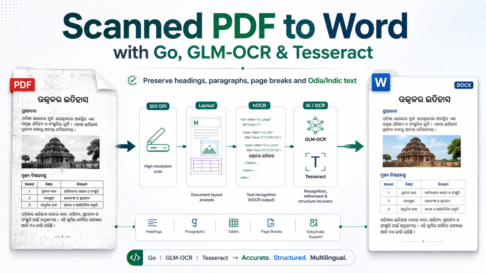

# pdf2word

Drop a PDF, get a `.docx` back — every page, formatting kept, Odia (ଓଡ଼ିଆ) intact.

It uses the PDF's own text layer when there is one, and OCR when the file is a
scan. OCR runs in hOCR mode rather than plain text, so tesseract's layout
analysis hands back paragraphs, line boxes and glyph heights — those become Word
paragraphs, alignment, first-line indents, font sizes and a page break wherever
the PDF page ended.

No Go dependencies: poppler and tesseract do the work, `archive/zip` writes the
`.docx` (a docx is a zip with three XML parts).

## Requirements

- Go 1.21+
- [poppler](https://poppler.freedesktop.org/) — `pdftotext`, `pdftoppm`
- [tesseract](https://github.com/tesseract-ocr/tesseract) plus the traineddata for your language (`ori` for Odia)

```sh
# Debian/Ubuntu
sudo apt install poppler-utils tesseract-ocr tesseract-ocr-ori
# macOS
brew install poppler tesseract-lang
```

On Windows, unzip a poppler release next to the project (`poppler-*/Library/bin`
is found automatically) or set `POPPLER_BIN`; set `TESSERACT` to the exe if it is
not on `PATH`.

## Run

```sh
go run .            # http://127.0.0.1:8080
```

Open the page, drop a PDF on it. Conversion starts on drop; the `.docx`
downloads when it finishes. A scanned book is slow — every page is OCR'd.

## Flags

| Flag | Default | What it does |
|---|---|---|
| `-addr` | `127.0.0.1:8080` | listen address |
| `-lang` | `ori` | tesseract language code |
| `-dpi` | `300` | render DPI before OCR |
| `-font` | `Nirmala UI` | font Word is asked for |
| `-pt` | `12` | point size body text maps to; everything else scales off it |
| `-headings` | `true` | second OCR pass to recover text the layout analyser filed as a picture (headings in coloured boxes); doubles OCR time |
| `-max` | `300MiB` | max upload size |

## Docker

```sh
docker build -t pdf2word .
docker run -p 8080:8080 pdf2word
```

The image ships poppler and the Odia traineddata, and listens on `$PORT` so it
drops straight onto Cloud Run, Fly or Render.

## Known limits

- Single-column reading order — a true two-column page will interleave.
- Bold is inferred from glyph height (tesseract 4 dropped font-attribute
  detection), so large text becomes a bold heading and nothing else is bold.
- Images and tables are not carried over; their text is.
- Pages are OCR'd one at a time.

## Test

```sh
go test ./...
```
